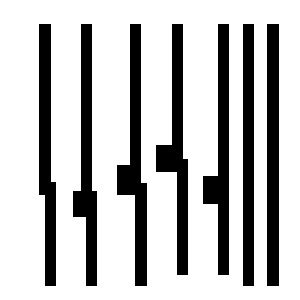
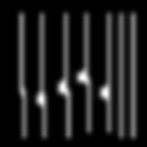
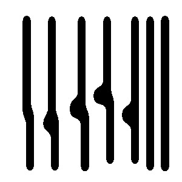
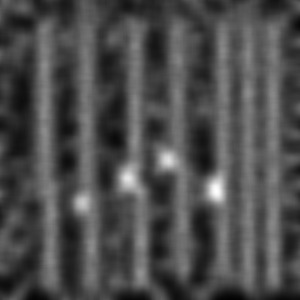
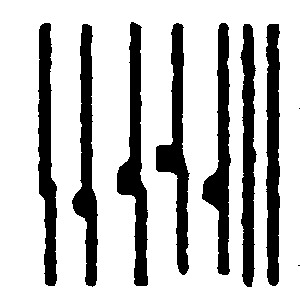

# lithosim

This is a very basic lithography simulation and pixel-based OPC tool.

## Simulation

The simulation uses an analytical model similar to [A. Poonawala,
P. Milanfar, “A Pixel-Based Regularization Approach to Inverse
Lithography”,Microelectronic Engineering, 84 (2007)
pp. 2837–2852](https://users.soe.ucsc.edu/~milanfar/publications/journal/Microelectronic_Final.pdf).

## OPC

The OPC just does a simulated annealing algorithm to minimize error
between the target mask and the simulated mask. It does not convert
the pixel-based mask into a manufacturable mask.

## Example Results

