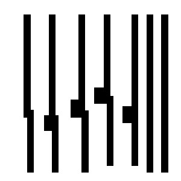
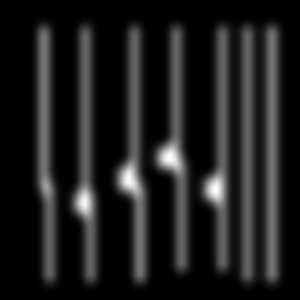
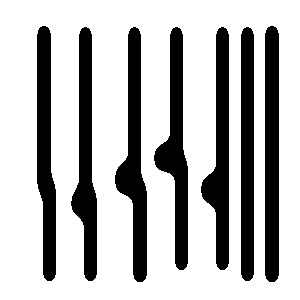
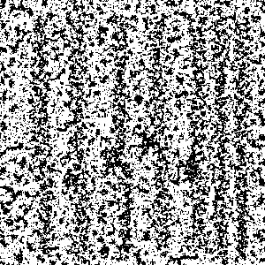
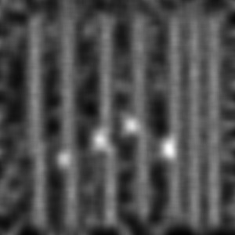
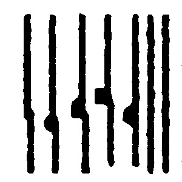

# lithosim

A lithography simulator with GDS layout support and physically-based optical/resist models.

## Features

- **GDS/OASIS input** via [gdstk](https://github.com/heitzmann/gdstk) — rasterize any layer from real layout files
- **Bitmap input** — PBM, PNG, or any Pillow-supported image format
- **Hopkins partially-coherent imaging** via SOCS (Sum of Coherent Systems) decomposition of the Transmission Cross-Coefficients (TCC)
- **Illumination sources**: conventional (disk), annular, dipole (x/y), quadrupole
- **Pupil function** with Zernike polynomial aberrations
- **Defocus simulation** via Zernike Z(2,0) coefficient
- **Resist model**: lumped parameter (Gaussian acid-diffusion blur + threshold)
- **Pixel-based OPC** via simulated annealing
- **Fully-coherent mode** (Jinc/Airy kernel) for fast approximate simulation

## Installation

Requires Python 3.9+. Uses [uv](https://docs.astral.sh/uv/) for dependency management:

```bash
uv sync
```

Dependencies: numpy, scipy, pillow, gdstk.

## Usage

```bash
# Basic simulation (coherent, bitmap input)
uv run python lithosim.py tests/tiny.pbm results/sim

# Partial coherence with conventional source
uv run python lithosim.py --sigma 0.75 tests/tiny.pbm results/sim

# GDS input, specific layer
uv run python lithosim.py --layer 1/0 --nm-per-pixel 4 layout.gds results/layer1

# Annular illumination
uv run python lithosim.py --source annular --sigma-inner 0.5 --sigma-outer 0.9 layout.gds results/ann

# Defocus + resist blur
uv run python lithosim.py --defocus 50 --resist-blur 30 tests/tiny.pbm results/defocus

# OPC
uv run python lithosim.py --opc tests/tiny.pbm results/opc
```

### Options

| Option | Default | Description |
|--------|---------|-------------|
| `--na` | 0.95 | Numerical aperture |
| `--wavelength` | 193.0 | Exposure wavelength (nm) |
| `--nm-per-pixel` | 8.0 | Grid resolution (nm/pixel) |
| `--source` | conventional | Source type: coherent, conventional, annular, dipole_x, dipole_y, quadrupole |
| `--sigma` | 0.75 | Partial coherence factor |
| `--sigma-inner` | 0.5 | Annular source inner radius |
| `--sigma-outer` | 0.9 | Annular source outer radius |
| `--n-kernels` | auto | Number of SOCS kernels to retain |
| `--defocus` | 0 | Defocus (nm) |
| `--threshold` | 0.2 | Resist clearing threshold |
| `--resist-blur` | 0 | Acid diffusion length (nm, Gaussian sigma) |
| `--layer` | first found | GDS layer/datatype (e.g. `1/0`) |
| `--padding` | 20 | Padding around GDS bounding box (pixels) |
| `--opc` | off | Run pixel-based OPC optimization |

### Output files

For a given `<prefix>`, the simulator writes:
- `<prefix>_aerial.png` — aerial image intensity
- `<prefix>_resist.png` — resist image (after diffusion blur)
- `<prefix>_contour.pbm` — binary contour (thresholded resist)
- `<prefix>_opc_mask.pbm` — OPC-optimized mask (if `--opc`)

## Optical Model

The simulator implements Hopkins partially-coherent imaging via SOCS decomposition:

1. Build the **Transmission Cross-Coefficient** (TCC) matrix from the illumination source and pupil function
2. **Eigendecompose** the TCC to obtain SOCS kernels and eigenvalues
3. Compute the aerial image as a weighted sum of coherent images:
   `I(x,y) = Σ λ_i |φ_i ⊛ mask|²`

This accurately models partial coherence effects that the original fully-coherent (single Jinc kernel) model could not capture.

## References

- A. Poonawala, P. Milanfar, ["A Pixel-Based Regularization Approach to Inverse Lithography"](https://users.soe.ucsc.edu/~milanfar/publications/journal/Microelectronic_Final.pdf), Microelectronic Engineering, 84 (2007) pp. 2837–2852
- H. H. Hopkins, "On the diffraction theory of optical images", Proc. R. Soc. A, 217 (1953)
- Y. C. Pati, T. Kailath, "Phase-shifting masks for microlithography: automated design and mask requirements", JOSA A, 11 (1994)

## Example Results

### Simulation
Mask, Aerial Image, Contours



### OPC
OPC Mask, OPC Aerial Image, OPC Contours


